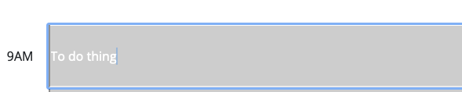

# Work Day Scheduler

## Description

Web app that lets us add tasks to a hour by hour scheduler.

## Installation

N/A

## Usage

Link to application: https://fumitsukai.github.io/Alex-work-day-scheduler/

You can add text into the text boxes.

That can be saved into localStorage so you can view even if you reload the page

Can clear the scheduler removing the localStorage data and reloading the app

## Credits

Thanks to David that helped me better understand how to handle the save buttons with jquery.

## License

Refer to licence is the repo.